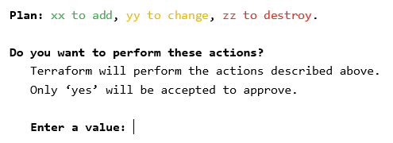

# Huawei Cloud LLD to Terraform

This repository contains Python scripts to convert project infrastruture
described by a Low-Level Design (LLD) spreadsheet into Huawei Cloud Terraform
code.

## DISCLAIMER

The developers of this tool are not responsible for data loss neither for
unexpected cost increases. You, the user of this tool, are the sole responsible
for checking the Terraform code output and the Terraform execution plan, and
**you are the sole responsible for the infrastructure updates consequences**
after you type `yes` when running the Terraform apply command.

**Always do a double check on the Terraform plan**, especially when there are
resources to be changed and/or destroyed.

## Requirements

- Miniconda: <https://docs.conda.io/en/latest/miniconda.html>
- Terraform: <https://developer.hashicorp.com/terraform/downloads>

## Installation (Python)

1. Create a Conda virtual environment using Python 3.10 (`lld-tf` is used as
   the environment name): `conda create -n lld-tf python=3.10 -y`
2. Activate the virtual environment: `conda activate lld-tf`
3. Install Python requirements with pip: `pip install -r requirements.txt`

## LLD to Terraform conversion

1. Fill the infrastructure information in the `LLD.xlsx`
2. Fill the LLD metadata in `metadata.xlsx`, used to tell where to look for
   data in the LLD
3. Activate the Conda virtual environment (if not already active):
   `conda activate lld-tf`
4. Run the Python script in the project's root directory: `python -m app.app`
5. Check the Terraform code generated inside `tf` folder

## Automatic conversion and manual work

For now, only the following resources are converted from LLD:

- VPCs and Subnets
- ECSs
  - Security group (assignment)
  - Multiple NICs
  - Multiple data disks
  - Shared disks
- Server group (anti affinity)

The following things need to be manually coded in Terraform:

- Security groups

Future work will be done for more resources to be converted automatically from
the LLD to Terraform code.

## Deploy with Terraform

Make a copy of `tf/terraform.tfvars.example` named `tf/terraform.tfvars` and
set ak, sk and region. Then, `cd` into the `tf` dir and run `terraform init`
the first time to download provider files, `terraform plan` to verify setup
and then `terraform apply` to deploy.

If the plan output is too large, dump it into a text file using the following
command: `terraform plan -no-color > plan_out.txt`. Then, open it in a text
editor to review it before applying.

## References

- Huawei Cloud Terraform provider documentation:
  <https://registry.terraform.io/providers/huaweicloud/huaweicloud/latest/docs>
- Regions and Availability Zones:
  <https://developer.huaweicloud.com/intl/en-us/endpoint>
